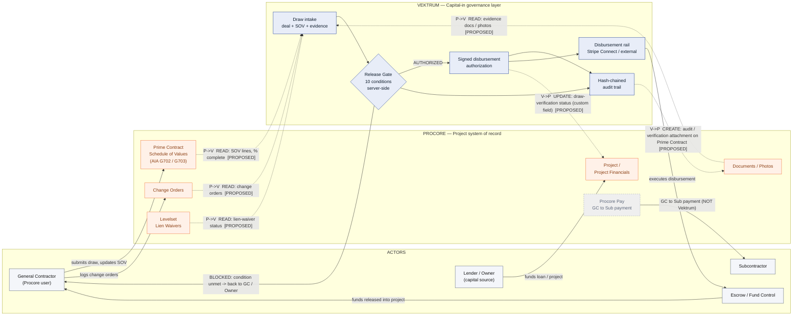

# Vektrum ⇄ Procore — Integration Workflow Diagram (Step 2)

**Grain (confirmed):** Vektrum governs the **owner/lender draw against the Prime
Contract**. A Vektrum draw maps to the **Procore Project + Prime Contract Schedule of
Values (AIA G702/G703)** — *not* Commitments. Commitments are the GC→sub layer owned by
Procore Pay and Levelset; Vektrum stays cleanly in the **capital-into-the-project** lane,
**beside** Levelset, never on top of it.

**Legend for line styles:** solid = **live today**; dotted + `[PROPOSED]` = **not yet
built** (feasible on Vektrum's existing Partner API + webhook framework). Every
cross-system exchange is labeled with **direction** (`P→V` Procore→Vektrum, `V→P`
Vektrum→Procore) and a **CRUD** verb.

---

## Written legend

### Actors (swimlane)
| Actor | Role in the flow |
|---|---|
| **Lender / Owner** | The capital source. Funds the loan/project; needs every draw verified before money is released. Vektrum's primary user. |
| **General Contractor** | The **Procore user**. Runs the project, submits the draw, maintains the SOV and change orders in Procore. |
| **Escrow / Fund Control** | Executes the disbursement on instruction once Vektrum authorizes (one supported external rail). |
| **Subcontractor** | Paid downstream via **Procore Pay / Levelset** — explicitly **outside** Vektrum's scope. |

### Systems
| System | Owns |
|---|---|
| **Procore** | Project system of record: Project Financials, **Prime Contract SOV**, Change Orders, Documents/Photos, Levelset waivers, Procore Pay (GC→sub). |
| **Vektrum** | Capital-in governance: draw intake, **10-condition release gate** (server-side), signed **disbursement authorization**, **hash-chained audit trail**, and the disbursement rail (Stripe Connect / external). |

### Named Procore tools/modules touched
- **Project / Project Financials** — parties + the write-back status field.
- **Prime Contract Schedule of Values (G702/G703)** — the draw's line-item source (READ) and the audit attachment target (CREATE).
- **Change Orders** — READ, to satisfy the "no unresolved change orders" gate condition.
- **Documents / Photos** — READ (draw evidence) and CREATE (verification attachment).
- **Levelset (Lien Waivers)** — READ status only; Vektrum sits beside it, never replaces it.
- **Procore Pay** — shown only to mark the GC→sub boundary Vektrum does **not** cross.

### Data exchanges (direction + CRUD + live/proposed)
| # | From → To | Direction | CRUD | Payload | Status |
|---|---|---|---|---|---|
| 1 | Prime Contract SOV → Vektrum | P→V | **Read** | SOV lines, revised value, % complete | `[PROPOSED]` |
| 2 | Change Orders → Vektrum | P→V | **Read** | change-order status/amounts | `[PROPOSED]` |
| 3 | Documents/Photos → Vektrum | P→V | **Read** | draw evidence | `[PROPOSED]` |
| 4 | Levelset → Vektrum | P→V | **Read** | lien-waiver status | `[PROPOSED]` |
| 5 | Vektrum → Prime Contract | V→P | **Create** | audit/verification attachment (hash-chained proof) | `[PROPOSED]` |
| 6 | Vektrum → Project | V→P | **Update** | draw-verification status (custom field) | `[PROPOSED]` |

**CRUD posture (by design):** the write-back is **Read-heavy, Create an attachment,
Update a status field — no Delete, and no writes into Procore's core financial tools.**
Vektrum adds a verification layer; it never mutates Procore's financial system of record.

### Live vs proposed at a glance
- **Live today (Vektrum-internal, verified in code):** draw intake, 10-condition gate,
  signed authorization tokens, hash-chained audit trail, Stripe Connect + external rails,
  DocuSign contract e-sign, lien-waiver gating, dispute isolation, and the Partner API +
  HMAC-signed webhook framework the connector would ride on.
- **Proposed (Procore-specific, not yet built):** OAuth app, all READ syncs (1–4), and
  both WRITE-backs (5–6).

*(A standalone copy of the chart is provided as `integration-diagram.mmd` for paste into
any Mermaid renderer.)*
