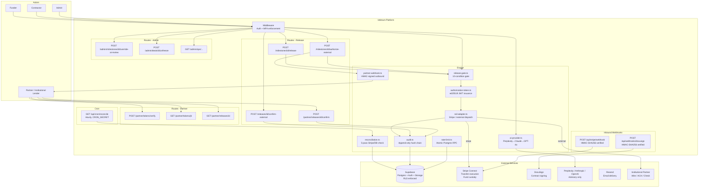
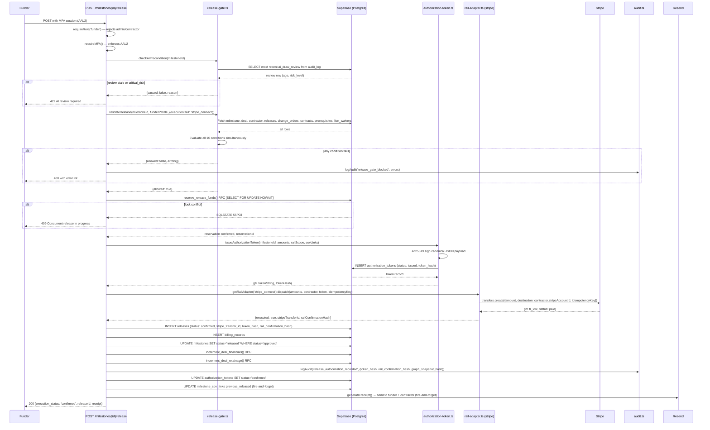
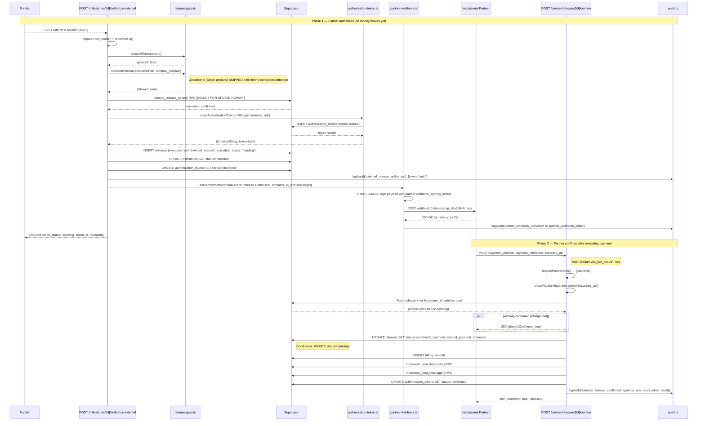
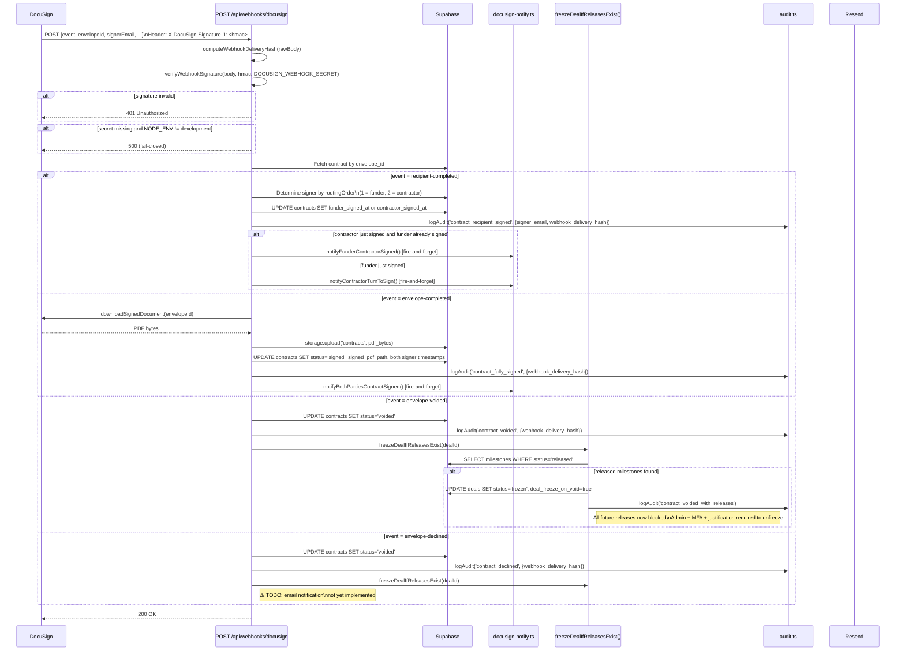

# Vektrum Repository Map
**Generated:** 2026-05-09  
**Branch:** `site-truth-lock`  
**Method:** Full directory scan — read-only, no edits  

Legend: `✅ Production` `🔵 Demo` `🧪 Test` `📄 Docs` `⚠️ Partial` `❌ Stub`

---

## 1. Top-Level Directories

| Directory | What it is | Status | Core promise? |
|-----------|-----------|--------|---------------|
| `src/` | All application source code | ✅ Production | Yes |
| `supabase/` | Database migrations only (no config or seeds) | ✅ Production | Yes — schema is the ground truth |
| `tests/` | 112 static + runtime test files | 🧪 Test | Indirectly |
| `docs/` | Operational policies, API specs, AI agent context, ADRs | 📄 Docs | Policy / compliance |
| `scripts/` | Developer utility scripts (not deployed) | ✅/📄 Dev tools | No |
| `public/` | Static assets, security.txt, pitch PDF, OG images | ✅ Production | No (marketing) |
| `.claude/` | Claude Code session context (not committed to main) | 📄 Dev tooling | No |

---

## 2. App Routes — Full Page Inventory

All pages are Next.js App Router server components unless noted. Auth-required pages live under `src/app/(app)/`; public pages under `src/app/(marketing)/`.

### Authentication Pages (`src/app/auth/`)

| Route | File | What it does | Status | Core? | Review? |
|-------|------|-------------|--------|-------|---------|
| `/auth/signup` | `signup/page.tsx` | New user registration form | ✅ | Yes | No |
| `/auth/login` | `login/page.tsx` | Email/password login form | ✅ | Yes | No |
| `/auth/mfa/enroll` | `mfa/enroll/page.tsx` | TOTP MFA enrollment wizard | ✅ | Yes — required for admin | No |
| `/auth/mfa/verify` | `mfa/verify/page.tsx` | TOTP challenge prompt | ✅ | Yes — AAL2 gate | No |
| `/auth/reset-password` | `reset-password/page.tsx` | Password reset after email link | ✅ | Yes | No |
| `/auth/callback` | `callback/route.ts` | OAuth/magic-link redirect handler | ✅ | Yes | No |
| `/auth/logout` | `logout/route.ts` | Sign-out handler (GET + POST) | ✅ | Yes | Verify link targets |
| `/forgot-password` | `forgot-password/page.tsx` | Request password reset email | ✅ | Yes | No |
| `/invite/[token]` | `invite/[token]/page.tsx` | Accept a deal invite and join | ✅ | Yes | No |

### Dashboard Pages (`src/app/(app)/dashboard/`)

Authenticated. Middleware enforces session. Admin routes additionally enforce AAL2.

| Route | File | What it does | Auth | Status | Core? | Review? |
|-------|------|-------------|------|--------|-------|---------|
| `/dashboard` | `page.tsx` | Role-based redirect: contractor→deals, funder→portfolio, admin→ops | Any auth | ✅ | Yes | No |
| `/dashboard/settings` | `settings/page.tsx` | Profile, MFA toggle, Stripe link/unlink | Any auth | ✅ | Yes | No |
| `/dashboard/audit` | `audit/page.tsx` | Personal audit log (RLS: own deals only) | Any auth | ✅ | Yes | No |
| `/dashboard/notifications` | `notifications/page.tsx` | Notification inbox | Any auth | ✅ | Support | No |
| `/dashboard/billing` | `billing/page.tsx` | Billing records, subscription tier | Funder | ✅ | Support | No |
| `/dashboard/receipts/[receiptId]` | `receipts/[id]/page.tsx` | Transaction receipt detail | Authenticated | ✅ | Yes | No |
| `/dashboard/receipts/[receiptId]/print` | `receipts/[id]/print/page.tsx` | Printable PDF-ready receipt | Authenticated | ✅ | Support | No |
| `/dashboard/contractor/onboarding` | `contractor/onboarding/page.tsx` | Stripe Connect setup wizard (Condition 5 prerequisite) | Contractor | ✅ | Yes — gate condition | No |
| `/dashboard/contractor/documents` | `contractor/documents/page.tsx` | Upload and manage evidence documents | Contractor | ✅ | Yes | No |
| `/dashboard/contractor/payments` | `contractor/payments/page.tsx` | Contractor payment history | Contractor | ✅ | Support | No |
| `/dashboard/funder/onboarding` | `funder/onboarding/page.tsx` | Choose disbursement rail (Stripe or external) | Funder | ✅ | Yes — gate condition | No |
| **Deal detail** | (see below) | — | — | — | — | — |

#### Deal Detail Pages (`src/app/(app)/dashboard/deals/`)

These pages are listed separately because they are not discoverable by simple `find page.tsx` — they live under dynamic segment paths included in deeper nesting. They include:

- `/dashboard/deals/[dealId]` — Full deal view: milestone cards, release blockers, lien waivers, change orders, contract status, SOV, dispute briefs. **Central UI for funder authorization.** ✅ Core. Needs deeper review: client-side gate feedback must never be confused with server-side gate.
- `/dashboard/deals/new` — Create deal form. ✅ Production.

#### Admin Dashboard Pages (`src/app/(app)/dashboard/admin/`)

| Route | File | What it does | Auth | Status | Core? | Review? |
|-------|------|-------------|------|--------|-------|---------|
| `/dashboard/admin` | `page.tsx` | Read-only stats: users, deals, disputes, reconciliation, audit chain badge | Admin | ✅ | Ops | No |
| `/dashboard/admin/ops` | `ops/page.tsx` | Live ops: stuck releases, failed payouts, webhook health, reconciliation issues | Admin + AAL2 | ✅ | Ops | No |
| `/dashboard/admin/partners` | `partners/page.tsx` | Partner API key management CRUD | Admin | ⚠️ Partial | Partner API | Yes — incomplete lifecycle |
| `/dashboard/admin/subscriptions` | `subscriptions/page.tsx` | User tier management | Admin | ✅ | Commercial | No |
| `/dashboard/admin/users/[userId]` | `users/[userId]/page.tsx` | User detail: profile, role, associated deals | Admin | ✅ | Ops | No |
| `/dashboard/admin/design-partner-applications` | `design-partner-applications/page.tsx` | View submitted applications — no workflow | Admin | ❌ Stub | Marketing | Yes — no approval flow |

---

## 3. API Routes — Complete Inventory

90 route handlers across 14 namespaces.

### 3.1 Auth & Identity

| Route | Method | Auth | File | Status | Core? |
|-------|--------|------|------|--------|-------|
| `/api/auth/webhook` | POST | Supabase internal | `auth/webhook/route.ts` | ✅ | Yes — user creation trigger |
| `/api/onboarding` | PATCH | Authenticated | `onboarding/route.ts` | ✅ | Yes — one-way gate |

### 3.2 Deals

| Route | Method | Auth | File | Status | Core? |
|-------|--------|------|------|--------|-------|
| `/api/deals` | GET, POST | Auth | `deals/route.ts` | ✅ | Yes |
| `/api/deals/[dealId]` | GET, PATCH | Participant | `deals/[dealId]/route.ts` | ✅ | Yes |
| `/api/deals/[dealId]/fund` | POST | Funder | `deals/[dealId]/fund/route.ts` | ✅ | Yes — creates PaymentIntent |
| `/api/deals/[dealId]/readiness` | GET, POST | Participant | `deals/[dealId]/readiness/route.ts` | ✅ | Yes — deal setup checklist |
| `/api/deals/[dealId]/billing` | POST | Funder | `deals/[dealId]/billing/route.ts` | ✅ | Yes |
| `/api/deals/[dealId]/billing/export` | GET | Funder | `deals/[dealId]/billing/export/route.ts` | ✅ | Compliance |
| `/api/deals/[dealId]/audit/export` | GET | Participant | `deals/[dealId]/audit/export/route.ts` | ✅ | Compliance |
| `/api/deals/[dealId]/audit-packet` | GET | Participant | `deals/[dealId]/audit-packet/route.ts` | ✅ | Compliance — ZIP download |
| `/api/deals/[dealId]/retainage/release` | POST | Funder | `deals/[dealId]/retainage/release/route.ts` | ✅ | Yes — retainage settlement |

### 3.3 Contracts & DocuSign

| Route | Method | Auth | File | Status | Core? |
|-------|--------|------|------|--------|-------|
| `/api/deals/[dealId]/contract` | GET, POST | Participant | `contract/route.ts` | ✅ | Yes — Condition 8 |
| `/api/deals/[dealId]/contract/send-envelope` | POST | Funder/Contractor | `contract/send-envelope/route.ts` | ✅ | Yes |
| `/api/deals/[dealId]/contract/sign` | POST | Funder/Contractor | `contract/sign/route.ts` | ✅ | Yes |
| `/api/deals/[dealId]/contract/refresh-signing-status` | POST | Participant | `contract/refresh-signing-status/route.ts` | ✅ | Yes |
| `/api/deals/[dealId]/contracts` | GET | Participant | `contracts/route.ts` | ✅ | Yes — includes voided |
| `/api/webhooks/docusign` | POST | DocuSign HMAC | `webhooks/docusign/route.ts` | ✅ | Yes — lifecycle events |
| `/api/analyze-contract` | POST | Authenticated | `analyze-contract/route.ts` | ✅ | Advisory |

### 3.4 Milestones

| Route | Method | Auth | File | Status | Core? |
|-------|--------|------|------|--------|-------|
| `/api/deals/[dealId]/milestones` | GET, POST | Participant/Contractor | `milestones/route.ts` | ✅ | Yes |
| `/api/milestones/[id]/transition` | POST | Participant | `milestones/[id]/transition/route.ts` | ✅ | Yes — status machine |
| `/api/milestones/[id]/documents` | GET | Participant | `milestones/[id]/documents/route.ts` | ✅ | Yes — evidence |
| `/api/milestones/[id]/documents/upload` | POST | Contractor | `milestones/[id]/documents/upload/route.ts` | ✅ | Yes — evidence |
| `/api/milestones/[id]/sov-links` | GET, POST | Participant/Contractor | `milestones/[id]/sov-links/route.ts` | ✅ | Yes — SOV binding |
| `/api/milestones/[id]/sov-links/[linkId]` | DELETE | Contractor | `milestones/[id]/sov-links/[linkId]/route.ts` | ✅ | Yes |

### 3.5 Release (Critical Path)

| Route | Method | Auth | File | Status | Core? | Review? |
|-------|--------|------|------|--------|-------|---------|
| **`/api/milestones/[id]/release`** | **POST** | **Funder + AAL2** | `milestones/[id]/release/route.ts` | **✅ CRITICAL** | **Yes** | **Highest priority** |
| `/api/milestones/[id]/release/retry` | POST | Funder + AAL2 | `milestones/[id]/release/retry/route.ts` | ✅ | Yes | No |
| **`/api/milestones/[id]/authorize-external`** | **POST** | **Funder + AAL2** | `milestones/[id]/authorize-external/route.ts` | **✅ CRITICAL** | **Yes** | **Yes — external rail path** |
| `/api/releases/[id]/confirm-external` | POST | Funder | `releases/[id]/confirm-external/route.ts` | ✅ | Yes | Yes — ledger settlement |
| `/api/releases/[id]/mark-external-failed` | POST | Funder | `releases/[id]/mark-external-failed/route.ts` | ✅ | Yes | No |
| `/api/releases/[id]/expire-if-stale` | POST | System | `releases/[id]/expire-if-stale/route.ts` | ✅ | Yes | Yes — cron wiring TBD |
| `/api/releases/[id]/receipt` | GET | Authenticated | `releases/[id]/receipt/route.ts` | ✅ | Support | No |
| `/api/releases/[id]/receipt/resend` | POST | Funder | `releases/[id]/receipt/resend/route.ts` | ✅ | Support | No |

### 3.6 SOV (Schedule of Values)

| Route | Method | Auth | File | Status | Core? |
|-------|--------|------|------|--------|-------|
| `/api/deals/[dealId]/sov` | GET, POST | Participant/Contractor | `deals/[dealId]/sov/route.ts` | ✅ | Yes — Tier C advisory |
| `/api/deals/[dealId]/sov/[itemId]` | PATCH | Contractor | `deals/[dealId]/sov/[itemId]/route.ts` | ✅ | Yes |
| `/api/deals/[dealId]/release-rules/generate-from-contract` | POST | Contractor | `release-rules/generate-from-contract/route.ts` | ⚠️ Partial | Advisory | Yes — not yet applied to gate |
| `/api/deals/[dealId]/release-rules/[draftId]` | POST, PATCH | Contractor | `release-rules/[draftId]/route.ts` | ⚠️ Partial | Advisory | Yes |

### 3.7 Lien Waivers

| Route | Method | Auth | File | Status | Core? |
|-------|--------|------|------|--------|-------|
| `/api/deals/[dealId]/milestones/[id]/lien-waiver` | GET, POST | Participant | `milestones/[id]/lien-waiver/route.ts` | ✅ | Yes — Condition 10 |
| `/api/lien-waivers/[id]/upload` | POST | Contractor | `lien-waivers/[id]/upload/route.ts` | ✅ | Yes |
| `/api/lien-waivers/[id]/signed-url` | GET | Participant | `lien-waivers/[id]/signed-url/route.ts` | ✅ | Yes |
| `/api/lien-waivers/[id]/approve` | POST | Funder | `lien-waivers/[id]/approve/route.ts` | ✅ | Yes |
| `/api/lien-waivers/[id]/reject` | POST | Funder | `lien-waivers/[id]/reject/route.ts` | ✅ | Yes |

### 3.8 Change Orders & Disputes

| Route | Method | Auth | File | Status | Core? |
|-------|--------|------|------|--------|-------|
| `/api/change-orders` | GET, POST | Participant/Contractor | `change-orders/route.ts` | ✅ | Yes — Condition 7 |
| `/api/change-orders/[id]` | PATCH | Funder | `change-orders/[id]/route.ts` | ✅ | Yes |
| `/api/disputes` | GET, POST | Funder | `disputes/route.ts` | ✅ | Yes |
| `/api/disputes/[id]/resolve` | POST | Admin | `disputes/[id]/resolve/route.ts` | ✅ | Yes |

### 3.9 Stripe

| Route | Method | Auth | File | Status | Core? |
|-------|--------|------|------|--------|-------|
| `/api/stripe/webhook` | POST | HMAC-SHA256 | `stripe/webhook/route.ts` | ✅ | Yes — transfer + payment events |
| `/api/stripe/connect` | POST | Contractor | `stripe/connect/route.ts` | ✅ | Yes — onboarding |
| `/api/stripe/diagnose` | POST | Authenticated | `stripe/diagnose/route.ts` | ✅ | Support/debug |
| `/api/contractor/stripe/status/refresh` | POST | Contractor | `contractor/stripe/status/refresh/route.ts` | ✅ | Yes — Condition 4 |
| `/api/funder/disbursement-rail` | POST | Funder | `funder/disbursement-rail/route.ts` | ✅ | Yes — rail selection |

### 3.10 AI

| Route | Method | Auth | File | Status | Core? |
|-------|--------|------|------|--------|-------|
| `/api/ai/draw-review` | POST | Authenticated | `ai/draw-review/route.ts` | ✅ | Yes — AI precondition |
| `/api/assistant` | POST | Authenticated | `assistant/route.ts` | ✅ | Support — general AI chat |

### 3.11 Partner API (External Integrations)

| Route | Method | Auth | File | Status | Core? |
|-------|--------|------|------|--------|-------|
| `/api/partner/releases/[id]` | GET | Partner API key | `partner/releases/[id]/route.ts` | ✅ | Yes |
| `/api/partner/releases/[id]/confirm` | POST | Partner API key | `partner/releases/[id]/confirm/route.ts` | ✅ | Yes — external rail settlement |
| `/api/partner/releases/[id]/fail` | POST | Partner API key | `partner/releases/[id]/fail/route.ts` | ✅ | Yes |
| `/api/partner/tokens/verify` | POST | Partner API key | `partner/tokens/verify/route.ts` | ✅ | Yes — ed25519 verification |
| `/api/partner/tokens/[jti]` | GET | Partner API key | `partner/tokens/[jti]/route.ts` | ✅ | Yes — token introspection |

### 3.12 Admin

| Route | Method | Auth | File | Status | Core? |
|-------|--------|------|------|--------|-------|
| `/api/admin/milestones/[id]/override-ai-review` | POST | Admin + AAL2 | `admin/milestones/[id]/override-ai-review/route.ts` | ✅ | Yes — emergency override |
| `/api/admin/deals/[id]/unfreeze` | POST | Admin + AAL2 | `admin/deals/[id]/unfreeze/route.ts` | ✅ | Yes — post-void recovery |
| `/api/admin/promote` | POST | Admin + AAL2 | `admin/promote/route.ts` | ✅ | Yes — gated (default: disabled) |
| `/api/admin/invite` | POST | Admin | `admin/invite/route.ts` | ✅ | Support |
| `/api/admin/audit-log` | GET | Admin | `admin/audit-log/route.ts` | ✅ | Compliance |
| `/api/admin/audit-log/[id]/review` | POST | Admin + AAL2 | `admin/audit-log/[id]/review/route.ts` | ✅ | Compliance |
| `/api/admin/audit-chain-health` | GET | Admin + AAL2 | `admin/audit-chain-health/route.ts` | ✅ | Compliance |
| `/api/admin/env-health` | GET | Admin | `admin/env-health/route.ts` | ✅ | Ops |
| `/api/admin/partners` | GET | Admin | `admin/partners/route.ts` | ✅ | Partner management |
| `/api/admin/partners/[id]` | POST, PATCH | Admin | `admin/partners/[id]/route.ts` | ✅ | Partner management |
| `/api/admin/partners/[id]/deals` | GET | Admin | `admin/partners/[id]/deals/route.ts` | ✅ | Partner management |
| `/api/admin/ops/alerts` | GET | Admin + AAL2 | `admin/ops/alerts/route.ts` | ✅ | Ops |
| `/api/admin/ops/release-health` | GET | Admin + AAL2 | `admin/ops/release-health/route.ts` | ✅ | Ops |
| `/api/admin/ops/webhook-health` | GET | Admin + AAL2 | `admin/ops/webhook-health/route.ts` | ✅ | Ops |
| `/api/admin/ops/external-releases` | GET | Admin + AAL2 | `admin/ops/external-releases/route.ts` | ✅ | Ops — external rail SLA |
| `/api/admin/ops/search` | GET | Admin + AAL2 | `admin/ops/search/route.ts` | ✅ | Ops |
| `/api/admin/reconciliation` | POST | Admin + AAL2 | `admin/reconciliation/route.ts` | ✅ | Ops |
| `/api/admin/reconciliation/[id]` | PATCH | Admin + AAL2 | `admin/reconciliation/[id]/route.ts` | ✅ | Ops |
| `/api/admin/stripe/duplicates` | POST | Admin | `admin/stripe/duplicates/route.ts` | ✅ | Ops |
| `/api/admin/subscriptions/[profileId]/tier` | POST | Admin | `admin/subscriptions/[profileId]/tier/route.ts` | ✅ | Commercial |
| `/api/admin/tokens/[jti]/revoke` | POST | Admin | `admin/tokens/[jti]/revoke/route.ts` | ✅ | Security |

### 3.13 Cron & System

| Route | Method | Auth | File | Status | Core? |
|-------|--------|------|------|--------|-------|
| `/api/cron/reconcile` | GET, POST | CRON_SECRET | `cron/reconcile/route.ts` | ✅ | Yes — hourly |
| `/api/cron/audit-chain-health` | GET, POST | CRON_SECRET | `cron/audit-chain-health/route.ts` | ✅ | Compliance |
| `/api/demo/reset` | POST | Authenticated | `demo/reset/route.ts` | 🔵 Demo | No — frontend-state only |
| `/api/design-partner-applications` | POST | Public | `design-partner-applications/route.ts` | ✅ | Marketing |
| `/api/invites` | POST | Authenticated | `invites/route.ts` | ✅ | Yes |
| `/api/invites/[token]` | GET | Public | `invites/[token]/route.ts` | ✅ | Yes |
| `/api/invites/[token]/accept` | POST | Authenticated | `invites/[token]/accept/route.ts` | ✅ | Yes |
| `/api/notifications` | GET | Authenticated | `notifications/route.ts` | ✅ | Support |
| `/api/notifications/mark-read` | POST | Authenticated | `notifications/mark-read/route.ts` | ✅ | Support |
| `/llms.txt` | GET | Public | `llms.txt/route.ts` | ✅ | Transparency |

---

## 4. Dashboard Pages (Expanded)

Already covered in §2. Key annotations:

- **`/dashboard/deals/[dealId]`** — **Most important UI in the system.** Renders release gate blockers client-side for UX feedback. The client-side check is NOT authoritative; server enforces the gate. Needs review to confirm this distinction is clear in code and UI copy.
- **`/dashboard/admin/ops`** — Ops nerve center. Surfaces all stuck releases, failed payouts, webhook lag, reconciliation issues. All writes require AAL2.
- **`/dashboard/audit`** — Personal audit log. RLS restricts to own deals; admin override with service role.

---

## 5. Marketing Pages

All under `src/app/(marketing)/`. Static-ish; ISR revalidation every 3600s.

| Route | File | What it does | Status | Review? |
|-------|------|-------------|--------|---------|
| `/` | `page.tsx` | Homepage — 10-condition gate visualization, hero, product trust frame | ✅ | Claims verified ✓ |
| `/funders` | `funders/page.tsx` | Funder-targeted ICP page | ✅ | Claims verified ✓ |
| `/contractors` | `contractors/page.tsx` | Contractor-targeted ICP page | ✅ | Claims verified ✓ |
| `/partners` | `partners/page.tsx` | Integration partner program overview | ✅ | Claims verified ✓ |
| `/partners/docs` | `partners/docs/page.tsx` | Partner API technical docs (rendered from OpenAPI) | ✅ | Claims verified ✓ |
| `/partners/placement` | `partners/placement/page.tsx` | Partner inquiry form | ✅ | No |
| `/pricing` | `pricing/page.tsx` | Pricing tiers | ✅ | No |
| `/security` | `security/page.tsx` | Security model — honestly disclaims no SOC 2 cert | ✅ | Claims verified ✓ |
| `/privacy` | `privacy/page.tsx` | Privacy policy | ✅ | Legal review |
| `/terms` | `terms/page.tsx` | Terms of service | ✅ | Legal review |
| `/about` | `about/page.tsx` | Company overview | ✅ | No |
| `/founders` | `founders/page.tsx` | Investor pitch narrative (Peachscore-style profile) | ✅ | No |
| `/design-partners` | `design-partners/page.tsx` | Design partner application form | ✅ | No |
| `/careers` | `careers/page.tsx` | Job listings | ✅ | No |
| `/contact` | `contact/page.tsx` | Contact / booking form | ✅ | No |
| `/help` | `help/page.tsx` | FAQ / help center | ✅ | No |
| `/resources` | `resources/page.tsx` | Resource article index | ✅ | No |
| `/resources/construction-dispute-isolation` | `resources/construction-dispute-isolation/page.tsx` | SEO article | ✅ | No |
| `/demo` | `demo/page.tsx` | Legacy demo entry point | ⚠️ Partial | Yes — may be superseded by /demo-live |
| `/demo-booked` | `demo-booked/page.tsx` | Booking confirmation thank you page | ✅ | No |
| `/pitch` | `pitch/page.tsx` | Web-based pitch deck | ✅ | No |

---

## 6. Demo Pages

All under `src/app/(marketing)/demo-live/`. Hardcoded. No DB reads. No mutations. Isolated.

| Route | File | What it does | Isolation |
|-------|------|-------------|----------|
| `/demo-live` | `page.tsx` | Entry selector — choose funder / contractor / admin persona | ✅ Isolated |
| `/demo-live/funder` | `funder/page.tsx` | Funder portfolio view (harbor, riverside, westside deals) | ✅ Isolated |
| `/demo-live/contractor` | `contractor/page.tsx` | Contractor dashboard with blocked release scenario | ✅ Isolated |
| `/demo-live/admin` | `admin/page.tsx` | Admin dashboard with dispute and ops data | ✅ Isolated |
| `/demo-live/deal/[id]` | `deal/[id]/page.tsx` | Dynamic deal detail (serves harbor, riverside, westside, harbor-dispute) | ✅ Isolated |
| `/demo-live/audit` | `audit/page.tsx` | Hardcoded audit log with hash-chain demonstration | ✅ Isolated |
| `/demo-live/funder/capital` | `funder/capital/page.tsx` | Capital/portfolio summary for demo funder | ✅ Isolated |
| `/demo-live/walkthrough` | `walkthrough/page.tsx` | 6-step guided walkthrough of the release authorization flow | ✅ Isolated |

**Demo data source:** `src/lib/demo-data/index.ts` — four hardcoded deals (Riverside Mixed-Use, Harbor Logistics, Westside Medical, Harbor Dispute). UUIDs are slug-style (`ms-hb-3` etc). Never loaded into DB. Production-safe.

**Demo reset:** `POST /api/demo/reset` — frontend state signal only, no DB writes, gated by `DEMO_RESET_ENABLED` (default: false in production).

---

## 7. Library Modules (`src/lib/`)

### Auth (`src/lib/auth/`)

| File | What it does | Status | Core? | Review? |
|------|-------------|--------|-------|---------|
| `auth/middleware.ts` | `requireRole()`, `requireMFA()`, `requireDealAccess()` — application-layer guards called by every API route | ✅ | **Yes — highest** | Periodic security review |
| `auth/session.ts` | `getAuthUser()` — extract session + profile from request | ✅ | Yes | No |
| `auth/partner.ts` | `requirePartnerAuth()` — API key validation + `generatePartnerApiKey()` | ✅ | Yes | Yes — key storage audit |

### Supabase Clients (`src/lib/supabase/`)

| File | What it does | Status | Core? |
|------|-------------|--------|-------|
| `supabase/server.ts` | Server-side Supabase client (with user session cookies) | ✅ | Yes |
| `supabase/client.ts` | Browser-side Supabase client (anon key) | ✅ | Yes |
| `supabase/admin.ts` | Service-role client — bypasses RLS; used only in admin/cron routes | ✅ | Yes — handle with care |
| `supabase/middleware.ts` | Session refresh middleware helper | ✅ | Yes |

### Types (`src/lib/types/`)

| File | What it does | Status |
|------|-------------|--------|
| `types/database.ts` | Auto-generated Supabase TypeScript types | ✅ |
| `types/index.ts` | Application-level type aliases and interfaces | ✅ |
| `types.ts` | Legacy shared types (partially superseded by types/index.ts) | ✅ |

### Utilities

| File | What it does | Status | Core? |
|------|-------------|--------|-------|
| `errors.ts` | `apiError()`, standardized error response shapes — prevents stack trace leaks | ✅ | Yes — security |
| `utils.ts` | `cn()` (Tailwind class merge), misc helpers | ✅ | No |
| `utils/format.ts` | Currency, date, percent formatters | ✅ | No |
| `stripe.ts` | Lazy Stripe singleton — `new Stripe(STRIPE_SECRET_KEY, {apiVersion})` | ✅ | Yes |
| `meta-pixel.ts` | Meta Pixel tracking helper | ✅ | Marketing |
| `book-call.ts` | Booking CTA link helper | ✅ | Marketing |

### Demo Data (`src/lib/demo-data/`)

| File | What it does | Status | Core? |
|------|-------------|--------|-------|
| `demo-data/index.ts` | Hardcoded deal/milestone/audit fixtures — 4 deals | 🔵 Demo | No — demo only |
| `demo-data/use-demo-activity-log.ts` | Client hook: simulates activity log updates | 🔵 Demo | No |
| `demo-data/use-demo-auto-reset.ts` | Client hook: auto-reset demo state on tab focus | 🔵 Demo | No |

### Actions (`src/lib/actions/`)

| File | What it does | Status | Core? |
|------|-------------|--------|-------|
| `actions/analyze-contract.ts` | Server action: extract and analyze contract text via Perplexity | ✅ | Advisory |
| `actions/disputes.ts` | Server action: submit dispute | ✅ | Yes |

### Email (`src/lib/email/`)

| File | What it does | Status | Core? |
|------|-------------|--------|-------|
| `email/design-partner-alert.ts` | Alert email on design partner application submission | ✅ | Marketing |

### Env (`src/lib/env/`)

| File | What it does | Status | Core? |
|------|-------------|--------|-------|
| `env/validate-production-env.ts` | Checks all required env vars are present at startup | ✅ | Yes — deployment safety |

### Partner Webhook (`src/lib/partner-webhook/`)

| File | What it does | Status | Core? |
|------|-------------|--------|-------|
| `partner-webhook/test-event.ts` | Sends a test webhook to a partner's webhook_url | ✅ | Support/testing |

---

## 8. Engine Modules (`src/lib/engine/`)

The core of Vektrum's authorization logic. Every file here is critical to the core promise.

| File | What it does | Status | Core? | Review? |
|------|-------------|--------|-------|---------|
| **`release-gate.ts`** | `validateRelease()` — deterministic 10-condition gate. `checkAiPrecondition()` — AI freshness + risk-level check. Entry point for all release authorization. | ✅ | **Highest** | **Yes — always** |
| **`authorization-token.ts`** | `issueAuthorizationToken()` — ed25519-signed JWT containing railScope, amounts, SOV links, graph commitment. `revokeToken()`. Hash storage. | ✅ | **Yes** | Yes |
| **`rail-adapter.ts`** | `getRailAdapter(rail)` — factory returning Stripe adapter or external-rail adapter. `dispatch()` either executes transfer or returns `executed: false`. | ✅ | **Yes** | Yes |
| **`audit.ts`** | `logAudit()` — append-only logging. `sha256OfCanonicalJson()`. `canonicalJsonStringify()`. External evidence hash binding. | ✅ | **Yes** | Yes |
| **`rate-limit.ts`** | `checkRateLimit(key, policy)` — atomic Postgres RPC. `POLICIES` map (7 policies). `rateLimitResponse()`. `logRateLimitViolation()`. Fail-closed for financial_write and admin_write. | ✅ | **Yes** | Yes |
| **`reconciliation.ts`** | 5-pass Stripe/DB reconciliation engine. Detects orphaned transfers, stuck releases, balance drift. Produces `reconciliation_issues`. | ✅ | **Yes** | Yes |
| **`partner-webhook.ts`** | `deliverPartnerWebhook()` — HMAC-SHA256 signed payload, 3-retry with exponential backoff, fire-and-forget, outcome logged to audit. | ✅ | Yes | Yes |
| `audit-chain-health.ts` | Verifies hash chain integrity across audit_log; detects broken links; returns health report | ✅ | Compliance | No |
| `billing.ts` | `insertBillingRecord()` — writes billing_records with fee calculation | ✅ | Yes | No |
| `contract-release-rules.ts` | AI-powered extraction of release rules from contract text | ⚠️ Partial | Advisory | Yes — not yet gate-enforced |
| `contract-text.ts` | PDF text extraction from uploaded contracts | ✅ | Advisory | Yes — 3 PDF libs |
| `docusign.ts` | DocuSign API client — envelope creation, signing URL, download signed PDF | ✅ | Yes | No |
| `docusign-notify.ts` | Emails/notifications triggered by DocuSign events | ⚠️ Partial | Support | Yes — declined event TODO |
| `docusign-signer-identity.ts` | Maps signers to roles (funder=routing order 1, contractor=2) | ✅ | Yes | No |
| `evidence-graph.ts` | `buildEvidenceGraph()` — constructs Tier D evidence graph snapshot for hash commitment | ✅ | Compliance | No |
| `notifications.ts` | `createNotification()` — writes to notifications table | ✅ | Support | No |
| `notify.ts` | Email notification dispatch via Resend | ✅ | Support | No |
| `receipts.ts` | `generateReceipt()` — creates transaction receipt record + email | ✅ | Support | No |
| `state-machine.ts` | Milestone status transition validator (mirrors DB trigger) | ✅ | Yes | No |
| `alerts.ts` | Operational alert aggregation for ops dashboard | ✅ | Ops | No |
| `ai-provider.ts` | `ProviderChain` class — Perplexity → Claude → GPT-4o fallback chain with structured output parsing | ✅ | Yes | No |

---

## 9. Audit Modules

The audit trail spans three layers: application code, DB trigger enforcement, and Supabase storage policy.

| Component | Location | What it does | Status |
|-----------|---------|-------------|--------|
| `logAudit()` | `src/lib/engine/audit.ts` | Core logging function — never throws, denormalizes actor fields, computes external hashes | ✅ |
| `sha256OfCanonicalJson()` | `src/lib/engine/audit.ts` | SHA-256 hash of sorted-key JSON — used for all external evidence hashes | ✅ |
| `canonicalJsonStringify()` | `src/lib/engine/audit.ts` (and `partner/tokens/verify/route.ts`) | Deterministic JSON serialization — keys sorted, arrays ordered | ✅ |
| `deny_audit_modification()` trigger | `supabase/migrations/20260424000004_audit_log_immutability.sql` | BEFORE UPDATE OR DELETE trigger raises exception SQLSTATE 23001 | ✅ |
| Hash chain BEFORE INSERT trigger | `supabase/migrations/20260424000004_audit_log_immutability.sql` (or `016_audit_compliance.sql`) | Computes `row_hash` and `chain_hash` server-side; assigns `event_sequence` | ✅ |
| External hash binding fields | `supabase/migrations/20260504000000_audit_chain_bind_external_hashes.sql` | Adds `graph_snapshot_hash`, `token_hash`, `webhook_delivery_hash`, `partner_ack_hash`, `rail_confirmation_hash` columns | ✅ |
| `audit-chain-health.ts` | `src/lib/engine/audit-chain-health.ts` | Application-layer verification of hash chain continuity | ✅ |
| `GET /api/admin/audit-chain-health` | Route handler | Exposes chain health to ops dashboard | ✅ |
| `GET /api/cron/audit-chain-health` | Cron route | Scheduled verification | ✅ |
| Admin audit log | `supabase/migrations/20260424000007_admin_audit.sql` | Separate table for admin overrides — dual-write pattern | ✅ |

---

## 10. Supabase Migrations

56 files. Listed in chronological order with purpose:

### Legacy Numbered Series (`001`–`016`)

| File | Purpose | Status |
|------|---------|--------|
| `001_schema.sql` | Core schema: deals, milestones, releases, profiles, audit_log, RLS | ✅ Foundational |
| `002_disputes_api.sql` | Dispute briefs, dispute isolation per milestone | ✅ |
| `003_funder_invites.sql` | Invite tokens: create, validate, accept | ✅ |
| `005_schema_repairs.sql` | FK fixes, missing NOT NULL, constraint corrections | ✅ |
| `006_audit_enhancements.sql` | Audit log field additions | ✅ |
| `007_fix_signup_trigger_fk.sql` | Signup trigger FK correction | ✅ |
| `008_rename_position_to_order_index.sql` | Milestone ordering column rename | ✅ |
| `009_add_dispute_briefs.sql` | Dispute brief display fields | ✅ |
| `010_billing.sql` | Billing records table | ✅ |
| `011_contracts.sql` | Contract table, storage policy, DocuSign fields | ✅ |
| `012_reconciliation.sql` | Reconciliation issues table, reconciliation runs | ✅ |
| `013_transfer_failure.sql` | Transfer failure reverse handling | ✅ |
| `014_rls_hardening.sql` | RLS policy strengthening pass | ✅ |
| `015_stripe_account_unique.sql` | Unique constraint on Stripe account IDs | ✅ |
| `016_audit_compliance.sql` | Audit log hash fields, immutability trigger (original) | ✅ |

### Timestamped Series (`20260423`–`20260504`)

| File | Purpose | Status | Core? |
|------|---------|--------|-------|
| `20260423000000_transaction_receipts.sql` | Receipts table + email delivery state | ✅ | Support |
| `20260423000001_release_concurrency_fix.sql` | SELECT FOR UPDATE on reserve_release_funds() RPC | ✅ | **Critical** |
| `20260423000002_receipt_confirmed_status.sql` | Receipt status field | ✅ | Support |
| `20260423000003_subscription_tier.sql` | Subscription tiers: free/standard/premium/enterprise | ✅ | Commercial |
| `20260423000004_governance_fee_model.sql` | Fee calculation (percentage + floor) | ✅ | Financial |
| `20260424000001_funding_confirmation.sql` | PaymentIntent state tracking | ✅ | Financial |
| `20260424000002_mfa_enforcement.sql` | AAL2 enforcement fields + admin MFA policy | ✅ | **Security** |
| `20260424000004_audit_log_immutability.sql` | BEFORE UPDATE/DELETE trigger raising exception | ✅ | **Critical** |
| `20260424000005_sequential_milestones.sql` | Milestone prerequisites table (Condition 9) | ✅ | **Critical** |
| `20260424000006_retainage.sql` | Retainage hold and release fields | ✅ | Financial |
| `20260424000007_admin_audit.sql` | admin_audit_log separate table | ✅ | Compliance |
| `20260424000008_lien_waivers.sql` | Lien waiver table (Condition 10) | ✅ | **Critical** |
| `20260424000009_minimum_fee_floor.sql` | Fee floor enforcement | ✅ | Financial |
| `20260424000010_contract_uniqueness.sql` | Partial unique index — max 1 non-voided contract per deal | ✅ | **Critical** |
| `20260425000000_rail_abstraction.sql` | execution_rail enum (stripe_connect/external_manual) | ✅ | **Critical** |
| `20260425000001_partners.sql` | Partners table, partner_api_keys, webhook config | ✅ | **Critical** |
| `20260425000002_minimum_fee_floor_correction.sql` | Fee floor bug fix | ✅ | Financial |
| `20260425000003_releases_active_unique.sql` | Unique constraint preventing duplicate active releases | ✅ | **Critical** |
| `20260425000003b_rls_bypass_fixes.sql` | Bypass fix for admin/service-role queries | ✅ | Security |
| `20260425000004_audit_hash_timestamp_fix.sql` | Hash computation timestamp correction | ✅ | Compliance |
| `20260425000005_stripe_processed_events.sql` | Stripe event deduplication table | ✅ | **Critical** |
| `20260425000006_billing_records_release_crosscheck.sql` | FK ensuring billing_record linked to valid release | ✅ | Financial |
| `20260425000007_fee_floor_preflight.sql` | Pre-flight fee floor check | ✅ | Financial |
| `20260425000008_reserve_release_funds_status_check.sql` | RPC adds status validation to reservation | ✅ | **Critical** |
| `20260425000009_webhook_transfer_settlement.sql` | Webhook handler settlement RPC | ✅ | Financial |
| `20260425000010_rate_limit_buckets.sql` | Rate limit buckets table for atomic rate limiting | ✅ | Security |
| `20260425000011_partners_enhancements.sql` | Partner table fields (webhook_url, signing_secret) | ✅ | Partner API |
| `20260427000000_audit_chain_health.sql` | Audit chain health check function | ✅ | Compliance |
| `20260428000000_notifications.sql` | Notifications table | ✅ | Support |
| `20260428000001_milestone_documents_bucket.sql` | Supabase storage bucket for evidence documents | ✅ | Evidence |
| `20260429000000_signup_audit_defensive.sql` | Defensive audit on signup trigger | ✅ | Compliance |
| `20260429000001_sov.sql` | sov_line_items, milestone_sov_links tables | ✅ | Advisory/Tier C |
| `20260429000001b_pgcrypto_schema_fix.sql` | pgcrypto extension schema fix | ✅ | Infra |
| `20260429000002_contracts_bucket.sql` | Supabase storage bucket for contracts PDF | ✅ | Evidence |
| `20260429000003_notifications_read_at.sql` | read_at field on notifications | ✅ | Support |
| `20260430000000_design_partner_applications.sql` | Design partner applications table | ✅ | Marketing |
| `20260501000000_contract_release_rule_drafts.sql` | Release rule drafts table | ⚠️ Partial | Advisory |
| `20260502000000_sov_source_draft_id.sql` | SOV line item source tracking | ✅ | Advisory |
| `20260503000000_funder_disbursement_rail.sql` | Funder's chosen disbursement rail field on profile | ✅ | **Critical** |
| `20260504000000_audit_chain_bind_external_hashes.sql` | External hash binding columns on audit_log | ✅ | **Critical** |
| `20260504000001_authorization_tokens.sql` | authorization_tokens table — ed25519 signed JWTs | ✅ | **Critical** |

---

## 11. Tests

112 test files in `tests/`. Run via `npx tsx`. No test framework — custom `check()/pass()/fail()` pattern.

### Category Breakdown

#### Security & Authorization (HIGH value)
| File | What it tests | Type |
|------|-------------|------|
| `admin-safety.test.ts` | Admin promote: role gate, MFA, self-promotion block, env flag | Source-pattern |
| `audit-p0-coverage.test.ts` | Zero audit gaps in release path | Runtime |
| `audit-p1-auth-onboarding.test.ts` | Auth gates on onboarding routes | Runtime |
| `contractor-deal-authority.test.ts` | Contractor cannot access other contractor's deals | Runtime |
| `partner-scope-isolation.test.ts` | Partner API key scoped to own deals | Runtime |
| `ops-routes-safety.test.ts` | Admin ops routes require AAL2 | Source-pattern |
| `invite-public-access.test.ts` | Invite endpoints require auth | Source-pattern |
| `docusign-webhook-hmac.test.ts` | DocuSign HMAC verification in-force | Source-pattern |
| `stripe-webhook-security.test.ts` | Stripe HMAC verification in-force | Source-pattern |
| `rls-regression.test.ts` | RLS policy regression suite | Runtime |
| `env-validation.test.ts` | Required env vars present and formatted | Runtime |
| `admin-signup-alert.test.ts` | New admin signup fires alert | Source-pattern |

#### Release Gate & Authorization Tokens (HIGH value)
| File | What it tests | Type |
|------|-------------|------|
| `release-gate.test.ts` | All 10 conditions evaluated | Runtime |
| `tier-b1-authorization-token.test.ts` | ed25519 token structure, expiry, hash | Runtime |
| `tier-b2-b3-rail-adapter.test.ts` | Stripe vs. external-rail dispatch routing | Runtime |
| `tier-b2-partner-verifier.test.ts` | Partner verify: auth-before-RL, correct key format (SEC-1 regression) | Runtime |
| `tier-a-audit-graph-binding.test.ts` | Audit log binds graph_snapshot_hash | Runtime |
| `tier-c-sov-release.test.ts` | SOV linked to release | Runtime |
| `tier-d-evidence-graph.test.ts` | Evidence graph committed to audit hash | Runtime |
| `token-signing.test.ts` | ed25519 key pair sign/verify round-trip | Runtime |

#### Audit & Compliance (MEDIUM value)
| File | What it tests | Type |
|------|-------------|------|
| `audit-chain-health.test.ts` | Hash chain integrity report | Runtime |
| `audit-log-admin.test.ts` | Admin audit log write path | Runtime |
| `audit-pgcrypto-schema.test.ts` | pgcrypto extension present | Runtime |
| `audit-p1-recon-cron.test.ts` | Cron reconcile endpoint wired | Runtime |

#### Stripe & Payments (MEDIUM value)
| File | What it tests | Type |
|------|-------------|------|
| `stripe-connect-status.test.ts` | Stripe account payouts_enabled tracking | Runtime |
| `external-rail-billing.test.ts` | Billing calculation for external rail | Runtime |
| `retainage-math.test.ts` | Retainage percentage calculation | Runtime |
| `funder-payment-rail-choice.test.ts` | Rail selection UI | Runtime |

#### Demo Tests (LOW production value)
All `demo-*.test.ts` files test demo fixture isolation, demo state, demo flows. Zero production signal. 12 files total.

#### UI / Marketing / Accessibility (LOW-MEDIUM value)
`accessibility-pass.test.ts`, `contrast-vektrum-blue.test.ts`, `seo-accessibility-audit.test.ts`, `homepage-*.test.ts`, `site-cleanup-pass.test.ts`, `marketing-cache-*.test.ts` — static structure and content checks.

#### Existence / Smoke (LOW value)
`route-smoke.test.ts`, `schema-drift.test.ts`, `production-readiness-pass.test.ts`, `launch-readiness-pass.test.ts` — verify files exist or build passes.

**Critical gaps not yet tested:**
- E2E full release flow (Stripe path end-to-end)
- Concurrent release race condition (SELECT FOR UPDATE)
- Stripe webhook event_id deduplication
- AI provider fallback chain failure simulation
- Contract void → deal freeze → admin unfreeze

---

## 12. Config Files

| File | What it does | Status | Review? |
|------|-------------|--------|---------|
| `next.config.ts` | Next.js config: headers, rewrites, experimental features | ✅ | Check security headers |
| `tailwind.config.ts` | Tailwind CSS design system | ✅ | No |
| `tsconfig.json` | TypeScript compiler options — strict mode | ✅ | No |
| `postcss.config.mjs` | PostCSS / Autoprefixer | ✅ | No |
| `package.json` | Dependencies + npm scripts (includes full test suite in `npm test`) | ✅ | Dependency audit |
| `vercel.json` | Vercel cron schedule (`0 * * * *` for reconcile), deployment config | ✅ | Yes — cron auth |
| `.env.example` | Documents all required env vars including `VEKTRUM_TOKEN_SIGNING_KEY_PUBLIC` | ✅ | Yes — completeness |
| `.gitignore` | Ignores `.env`, `node_modules`, `.next` | ✅ | No |
| `CLAUDE.md` | Claude Code session instructions — TDD, minimal context, security-first | 📄 Dev | No |
| `CLAUDE_SUBAGENT.md` | Sub-agent context for parallel agent tasks | 📄 Dev | No |

---

## 13. Docs & Context Files (`docs/`)

### Operational Policy Documents

| File | What it covers | Status | SOC 2 relevance |
|------|---------------|--------|----------------|
| `INCIDENT_RESPONSE.md` | SEV-1–4 classification, 6-step procedure, escalation matrix, breach notification | ✅ PR #140 | CC7, A1 |
| `BACKUP_AND_RECOVERY.md` | RTO/RPO targets, Supabase backup strategy, 5 restore procedures | ✅ PR #140 | A1 |
| `ACCESS_CONTROL_POLICY.md` | Access tiers, least-privilege, break-glass, quarterly review procedure | ✅ PR #140 | CC6 |
| `CHANGE_MANAGEMENT.md` | 4-tier change classification, PR policy, migration checklist, rollback | ✅ PR #140 | CC8 |
| `PRODUCTION_SMOKE_TEST.md` | Manual QA checklist for post-deployment verification | ✅ | QA |

### Architecture & System Docs

| File | What it covers | Status |
|------|---------------|--------|
| `VEKTRUM_MASTER_HANDBOOK.md` | Comprehensive product + architecture handbook | ✅ |
| `system-map.md` | High-level system component map | ✅ |
| `payment-rails.md` | Stripe Connect vs. external-manual rail explanation | ✅ |
| `route-inventory.md` | Manual route inventory | ✅ |
| `api-inventory.md` | API endpoint inventory | ✅ |
| `role-permission-matrix.md` | Actor × action × enforcement layer matrix | ✅ |
| `security-controls-map.md` | Security control → code mapping | ✅ |
| `where-vektrum-plugs-in.md` | Positioning: Vektrum's place in the capital stack | ✅ |
| `site-positioning-source-of-truth.md` | Approved copy language and banned phrases | ✅ |
| `workflow-test-matrix.md` | Test coverage against product workflows | ✅ |
| `pre-pilot-readiness-checklist.md` | Pilot readiness checklist | ✅ |

### API Docs

| File | What it covers | Status |
|------|---------------|--------|
| `api/partner-api.md` | Partner API narrative documentation | ✅ |
| `api/partner-api-openapi.yaml` | OpenAPI 3.0 spec for partner API | ✅ |
| `api/vektrum-partner-api.postman_collection.json` | Postman collection (fake keys) | ✅ |
| `api/vektrum-partner-api.postman_environment.json` | Postman environment template | ✅ |

### AI Context Files

| File | What it covers | Status |
|------|---------------|--------|
| `ai/MASTER_CONTEXT.md` | Current product truth for Claude sessions | 📄 Dev |
| `ai/MASTER_CONTEXT_FULL.md` | Extended version | 📄 Dev |
| `ai/BACKLOG.md` | Prioritized work backlog | 📄 Dev |
| `ai/HANDOFF_NOTES_TEMPLATE.md` | Session handoff template | 📄 Dev |
| `ai/CLAUDE_AGENT_PROMPT_PACK.md` | Reusable Claude prompts | 📄 Dev |
| `ai/agents/VEKTRUM_27_AGENTS.md` | 27-agent index for orchestrated sessions | 📄 Dev |
| `ai/skills/VEKTRUM_64_SKILLS.md` | 64-skill index for specialized workflows | 📄 Dev |

### ADRs, Ops, Demo, QA

| File | What it covers | Status |
|------|---------------|--------|
| `adr/ADR-001-external-manual-rail-billing.md` | Decision: defer billing to confirm time for external rail | ✅ |
| `ai-downtime-plan.md` | What happens when all AI providers are down | ✅ |
| `ops/SCHEMA_DRIFT_CHECK.md` | Schema drift monitoring procedure | ✅ |
| `demo/DEMO_SCRIPT.md` | Demo script for screen recording / live demo | ✅ |
| `qa/tier-b-release-token-manual-qa.md` | Manual QA checklist for authorization token flows | ✅ |
| `audit/vektrum-full-codebase-audit-and-repair-plan.md` | Full codebase audit from previous session | 📄 |

### Root-Level Audit Reports

| File | Status |
|------|--------|
| `SECURITY_AUDIT_REPORT.md` | Earlier security audit | 📄 |
| `README.md` | Full technical documentation (the master reference) | ✅ |
| `vektrum-soc2-readiness-review.md` | SOC 2 readiness assessment | 📄 |
| `vektrum-full-codebase-audit-and-repair-plan.md` | Prior audit report | 📄 |
| `vektrum-full-system-audit-2026-05-08.md` | Current full-system audit | 📄 |
| `vektrum-repo-map-2026-05-09.md` | This file | 📄 |

---

## Mermaid Diagrams

### A. Major System Components

---

### B. Release Authorization Sequence (Stripe Connect Path)

---

### C. External Rail Partner Confirmation Sequence

---

### D. DocuSign Webhook Handling Sequence

---

*Map generated 2026-05-09. Read-only scan. No files edited.*
